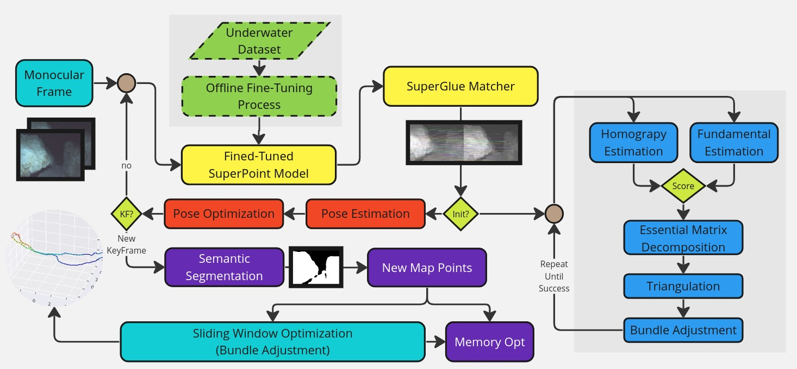
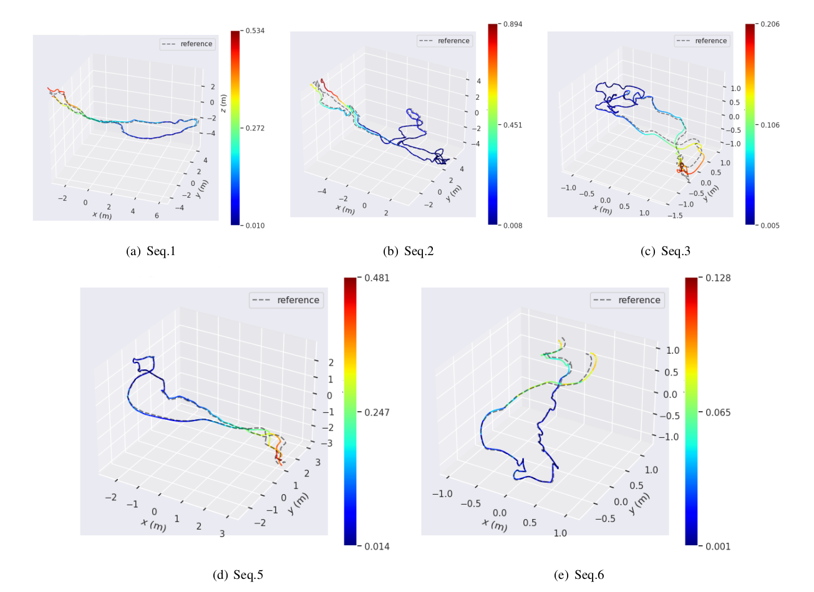

# UR-MVO: Underwater Robust Monocular Visual Odometry

## Table of Contents

- [Introduction](#introduction)
- [Contributors](#contributors)
- [Superpoint Finetuning](#superpoint-finetuning)
- [Installation](#installation)
- [Usage](#usage)
- [Evaluation](#evaluation)
- [Acknowledgments](#acknowledgments)

## Introduction

UR-MVO is a robust monocular visual odometry pipeline designed specifically for underwater environments. Leveraging cutting-edge techniques such as SuperPoint for feature extraction and SuperGlue for feature matching, UR-MVO offers enhanced performance and reliability in underwater navigation tasks. Additionally, we incorporate semantic segmentation to improve the robustness of feature extraction, effectively filtering out features associated with dynamic objects or background clutter.

## Contributors

- [Zein Barhoum](https://github.com/ZeinBarhoum)
- [Jaafar Mahmoud](https://github.com/JaafarMahmoud1)
- [Yazan Maalla](https://github.com/yazanmaalla)
- [Sulieman Daher](https://github.com/suliemanda)
- [Alexander Topolnitskii](https://github.com/InsightofSPb)
## Scientific Supervision
- [Sergey Kolyubin](https://scholar.google.com/citations?user=2Js0FRUAAAAJ&hl=en)

<!-- ## Superpoint Finetuning

## Installation

## Usage -->

## Evaluation

The experiments were conducted on the real underwater dataset [Aqualoc](https://www.lirmm.fr/aqualoc/).

The trajectories generated by our method
for Harbor sequences compared to the ground truth trajectories:

<iframe width="560" height="315" src="https://youtu.be/j7xBm6b5tUg" frameborder="0" allow="accelerometer; autoplay; clipboard-write; encrypted-media; gyroscope; picture-in-picture" allowfullscreen></iframe>

 
Numerical Results ( **ATE** -*Absolute Translation Error* )  compared with other VO and VSLAM solutions.

| Sequence | #1 | #2  | #3 | #4 |  #5  | #6  | #7  | 
|---------|--------|-------|-----------|-------|-------|-------| ------|
| ORBSLAM*   | 0.52  | <u>0.50<u>| 0.45     | X | <u>0.24<u> | 0.51 | X | 
| DSO   | X  |0.63 | <u>0.25<u>     |X  | 0.67 |0.24 |  X | 
| SVO   | <u>0.49<u>  | 0.56 | 0.26     | X | X | **0.02**|  X | 
| UR-MVO (ours)   | **0.26**  | **0.3** | **0.096**     | X | **0.22** | <u>0.047<u> |  X | 

| Sequence | #1 | #2  | #3 | #4 |  #5  | #6  | #7  | 
|---------|--------|-------|-----------|-------|-------|-------| ------|
| LDSO   | X  | X | X     | X | 0.7 | 0.78 | X | 
| UVS   | <u>0.44<u>  | **0.19** | **0.025**     | **0.29** | **0.11** |<u>0.09<u>  |  X | 
| ORBSLAM   | X  | 0.44 | <u>0.031<u>     | X | <u>0.15<u> | 0.11 |  X | 
| UR-MVO (ours)   | 0.26  | <u>0.3<u> | 0.096     | X | 0.22 | **0.047** |  X | 

## Acknowledgments

We extend our gratitude to the creators of [ORB-SLAM3](https://github.com/UZ-SLAMLab/ORB_SLAM3) and [AirVO](https://github.com/sair-lab/AirVO) for their inspiring work, which has influenced and contributed to various aspects of our project.

